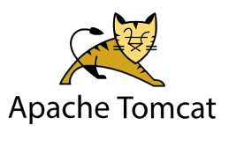
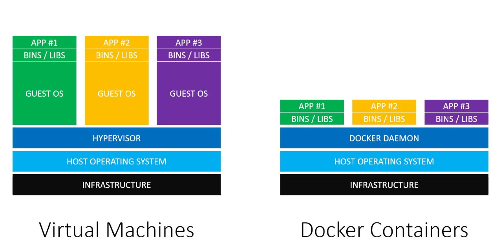
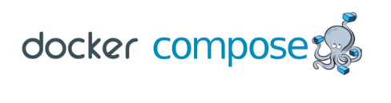

# **UNIDAD 3:** SERVIDORES DE APLICACIONES

### Links externos de esta unidad:

- 📊 [Diapositivas de la Unidad 3](http://jamj2000.github.io/despliegueaplicacionesweb/3/diapositivas)
- 📚 [Actividades de la Unidad 3](http://jamj2000.github.io/despliegueaplicacionesweb/3/actividades)

---

## Índice

- 1 - Introducción
- 2 - Conceptos básicos
- 3 - Tomcat
- 4 - JBoss / WildFly
- 5 - Contenedores Docker

---

## 1️⃣ - Introducción

### 1.1 - En esta Unidad aprenderemos a

- Identificar los principales archivos de configuración y de bibliotecas compartidas.
- Realizar los ajustes necesarios para el despliegue de aplicaciones sobre el servidor.
- Realizar pruebas de funcionamiento y rendimiento de la aplicación Web desplegada.
- Elaborar documentación relativa al despliegue de aplicaciones sobre el servidor de aplicaciones.

- - - 

## 2️⃣ - Conceptos básicos

### 2.1 - Ediciones de Java

- **Java Card**
- **Micro Edition** (**ME**)
- **Standard Edition** (**SE**)
- **Enterprise Edition** (**EE**)
- **JavaFX**

### 2.2 - Tipos de archivos

- **JAR** (Java ARchive): Permite almacenar aplicaciones escritas en el lenguaje Java. Formato ZIP pero extensión .jar.

- **WAR** (Web Application aRchive): Es un archivo JAR (con la extensión WAR) para distribuir archivos JSP, servlets, clases Java, archivos XML y contenido web estático (HTML). En conjunto constituyen una aplicación Web.

- **EAR** (Enterprise Application aRchive): Formato usado por Java EE para empaquetar en un sólo archivo varios módulos y para desplegar (mediante archivos XML llamados descriptores de depliegue) en un servidor de aplicaciones.

---

## 3️⃣ - TOMCAT

**Servidor web y Contenedor de servlets**



### 3.1 - Instalación

```bash
# En Ubuntu 16.04 y 18.04
apt  install  tomcat8   tomcat8-admin

# Opcionalmente puede instalarse también
apt  install  tomcat8-docs  tomcat8-examples
```

Una vez instalado, Tomcat estará disponible en **http://localhost:8080**

### 3.2 - Configuración

```bash
/etc/tomcat8/
/etc/tomcat8/tomcat-users.xml
```

Insertamos las siguientes líneas en **/etc/tomcat8/tomcat-users.xml**.

```xml
<role rolename="manager-gui"/>
<role rolename="admin-gui"/>
<user username="tomcat" password="tomcat" roles="manager-gui,admin-gui"/>
```

### 3.3 - Construir webapp

1. Descargamos código fuente de aplicación
2. Revisamos los siguientes archivos

```
<SOURCE>/pom.xml
<SOURCE>/src/main/resources/applicationContext.xml
```

3. Construimos con maven

```bash
mvn  clean  package
```

4. Revisamos los archivos generados

```
<SOURCE>/target/<APP>.war
<SOURCE>/target/<APP>/
```

### 3.4 - Desplegar en tomcat

1. Accedemos a **http://localhost:8080/manager/html**
2. Seleccionamos archivo **`.war`** a desplegar.
3. Y pulsamos en botón **Desplegar**.

#### Carpetas de una Webapp

```bash
/var/lib/tomcat8/
/var/lib/tomcat8/webapps/
/var/lib/tomcat8/webapps/<APP>/WEB-INF/web.xml
/var/lib/tomcat8/webapps/<APP>/WEB-INF/lib/
/var/lib/tomcat8/webapps/<APP>/WEB-INF/classes/
/var/lib/tomcat8/webapps/<APP>/WEB-INF/classes/applicationContext.xml
```

- Directorio principal (raíz): Contendrá los ficheros estáticos (HTML, imágenes, etc...).
  - Carpeta **`WEB-INF`** : contiene el fichero **`web.xml`** (descriptor de la aplicación), encargado de configurar la aplicación.
    - Subcarpeta **`classes`** : contiene los ficheros compilados (servlets, beans).
    - Subcarpeta **`lib`** : librerías adicionales.
  - Resto de carpetas para ficheros estáticos.

---

## 4️⃣ - JBOSS / WILDFLY

**Servidor de aplicaciones**


#### Características

- También conocido como **WildFly Application Server**
- Servidor de aplicaciones de código abierto.
- Implementa la especificación Java EE.
- Anteriormente conocido como **JBoss AS**.
- Escrito en Java. Desarrollado por **RedHat**.

---

## 5️⃣ - Contenedores Docker

#### VMs / Containers




### 5.1 - Características de Docker

- Proyecto de código abierto.
- Actualmente es estándar de facto en contenedores. Otros sistemas son LXD, LXC, RKT, ...
- Permite automatizar el despliegue de aplicaciones dentro de "contenedores".
- Un contenedor empaqueta todo lo necesario para que una aplicación funcione: código y dependencias.
- No hay que preocuparse de qué software ni versiones tiene nuestra máquina.
- Un contenedor es un objeto portable, ligero y autosuficiente.

### 5.2 - Ventajas y desventajas de Docker

#### Ventajas

- Los contenedores se inician en pocos segundos.
- Son fácilmente replicables.
- Consumen menos recursos que las máquinas virtuales tradicionales.
- Ocupan mucho menos espacio.
- Permite aislar las dependencias de una aplicación de las instaladas en el host.
- Existe un gran repositorio de imágenes ya creadas, que además
  pueden modificarse libremente. Es DockerHub: https://hub.docker.com

#### Desventajas

- Los contenedores no están 100% aislados. Usan el kernel del anfitrión.
- Mejor rendimiento en Linux que en otras plataformas.
- Existe cierta curva de aprendizaje.

### 5.3 - Comandos de docker

```bash
docker login
docker logout
docker pull ...
docker push ...
docker run ...
docker exec ...
docker images
docker ps
docker rmi ...
docker rm ...
```

#### docker run

- Nos permite ejecutar un contenedor a partir de una imagen.
- Si no tenemos la imagen localmente, entonces la descarga.

```bash
docker  run  -d  -p 8090:80  -v /var/www/html:/usr/share/nginx/html  nginx
```

**Opciones**

- `-d`, `--detach`: libera el terminal, se ejecuta en segundo plano.
- `-p ...`, `--publish=...`: puertos de red mapeados en localhost.
- `-v ...`, `--volume=...`: directorios mapeados en localhost.

#### docker exec

- Nos permite lanzar un ejecutable del interior del contenedor.
- A menudo el comando a lanzar es `bash`, para trabajar dentro del contenedor.

```bash
docker  exec  -it  9a60b60be82d  bash
```

**Opciones**

- `-i`, `--interactive`: mantiene STDIN abierta
- `-t`, `--tty`: se reserva un terminal pseudo-TTY
- `9a60b60be82d`: es el ID del contenedor, puede obtenerse con `docker ps`

### 5.4 - docker-compose



#### Características de docker-compose

- Permite definir y ejecutar aplicaciones multicontenedor.
- Usa un archivo YAML para configurar los servicios de la aplicación.
- Dicho archivo por defecto se llama `docker-compose.yml`.
- Con un solo comando, crea e inicia todos los servicios.

#### Ejemplo docker-compose.yml

```yaml
version: "2"
services:
  tomcat:
    image: "tomcat:8.0-jre8"
    ports:
      - "8080:8080"
    depends_on:
      - sqlserver
  sqlserver:
    image: "microsoft/mssql-server-linux:2017-latest"
    environment:
      SA_PASSWORD: "Temporal22"
      ACCEPT_EULA: "Y"
    volumes: ./docs:/data
```

#### Comandos de docker-compose

```bash
docker-compose  up  -d
docker-compose  down
```
