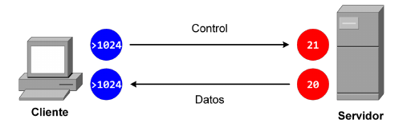
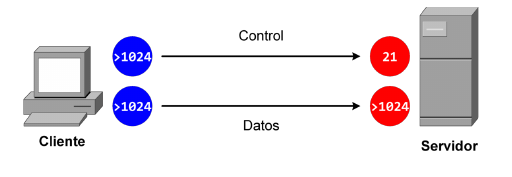

# SERVIDORES DE TRANSFERENCIA DE ARCHIVOS

- [Diapositivas](http://jamj2000.github.io/despliegueaplicacionesweb/4/diapositivas)
- [Actividades](http://jamj2000.github.io/despliegueaplicacionesweb/4/actividades)


## Índice
--- 
- ### Introducción
- ### Protocolo FTP
- ### vsFTPd: Instalación
- ### vsFTPd: Configuración

<!--- Note: Nota a pie de página. -->


## Introducción


### En esta Unidad aprenderemos a

- Instalar y configurar servidores de transferencia de archivos.
- Crear usuarios y grupos para el acceso remoto al servidor.
- Realizar pruebas con clientes en línea de comandos y clientes en modo gráfico.
- Utilizar el protocolo seguro de transferencia de archivos..


## Protocolo FTP


### FTP

**File Transfer Protocol**

- Arquitectura **cliente/servidor**.
- El cliente solicita la transferencia y el servidor responde.
- El servidor usa por defecto 2 puertos:
  - **Puerto 21**: puerto de control.
  - **Puerto 20**: puerto de datos.


### Clientes y servidores

- Clientes:
  - **ftp**  (terminal)
  - gftp
  - **filezilla**
  - navegador web (`ftp://servidor`)
- Servidores
  - **vsftpd**
  - proftpd


### Tipos de usuarios

- **Usuario anónimo**: 
  - no disponen de cuenta en el servidor.
  - conectan con `anonymous`/`correo@dominio`.
  - Permisos de sólo lectura.
- **Usuarios del sistema**: 
  - disponen de cuenta en el servidor. **Pueden iniciar sesión** de terminal.
  - conectan con `usuario`/`clave`.
- **Usuarios virtuales**
  - disponen de cuenta en el servidor. **NO pueden iniciar sesión** de terminal.
  - conectan con `usuario`/`clave`.


### Modos de transferencia

- **Texto**: para transferir archivos que sólo tienen caracteres imprimibles: txt, html, ...
- **Binario**: para transferir cualquier tipo de archivo: pdf, jpg, ... Es el modo **recomendado**.


### Modos de funcionamiento

**Activo**



**Pasivo**




### Seguridad

- FTP es un protocolo no seguro.
- Existen 2 formas de hacerlo seguro:
  - **Usar SSH**: es necesario una conexión ssh subyacente.
    - **SFTP** (SSH File Transfer Protocolo)
  - **Usar SSL/TLS**: es necesario un certificado digital.
    - **FTPS**. Usa los puertos 990 (control) y 989 (datos).
    - **FTPES**. Más moderno. Recomendado.


## vsFTPd: Instalación

**`apt  install  vsftpd`**


### Gestión del servicio 

```bash
systemctl  start   vsftpd  # service vsftpd start
systemctl  restart vsftpd  # service vsftpd restart
systemctl  stop    vsftpd  # service vsftpd stop
systemctl  status  vsftpd  # service vsftpd status

systemctl  enable  vsftpd  
systemctl  disable vsftpd  
```


## vsFTPd: Configuración

**`/etc/vsftpd.conf`**


### Usuario anónimo

```bash
# Permitir acceso anónimo
anonymous_enable=YES

# Directorio por defecto
anon_root=/srv/ftp/

# Puede acceder sólo a archivos legibles por todo el mundo
anon_world_readable_only=YES
```


### Usuarios locales

**También se aplica a los usuarios virtuales**

```bash
# Permitir el acceso a los usuarios locales y virtuales
local_enable=YES

# Permisos de escritura
write_enable=YES

# Permisos de las carpetas: 777-022=755
# Permisos de los archivos: 666-022=644
local_umask=022
```


### Enjaular usuarios locales

**También se aplica a los usuarios virtuales**

```bash
# Enjaulamos a todos los usuarios 
# excepto los indicados en /etc/vsftpd.chroot_list
chroot_local_user=YES
chroot_list_enable=YES
chroot_list_file=/etc/vsftpd.chroot_list
```


### Usuarios virtuales

- Son muy útiles si tenemos varios sitios virtuales en nuestro servidor web.
- Cada sitio virtual pertenece a un usuario.
- Una forma sencilla de crear un usuario virtual es la siguiente.

```bash
adduser  --shell /bin/false  --home /var/www/usuario   usuario
echo "/bin/false" >> /etc/shells
```


### FTP seguro

- Necesitaremos un certificado digital.
- Podemos utilizar el que viene en Ubuntu
  - /etc/ssl/private/ssl-cert-snakeoil.key  ( clave privada )
  - /etc/ssl/certs/ssl-cert-snakeoil.pem    ( certificado )
- O podemos generar uno nosotros.

```bash
# Generamos clave privada y certificado en un único archivo
make-ssl-cert  \
   /usr/share/ssl-cert/ssleay.cnf \
   /etc/ssl/private/vsftpd.pem
```


### FTP seguro

```bash
# Activar el soporte SSL
ssl_enable=YES

# Se habilitan los soportes para las diversas versiones de SSL
ssl_tlsv1=YES
ssl_sslv2=YES
ssl_sslv3=YES

# Cifrado. 
# El cifrado (DES-CBC3-SHA) por defecto no es soportado por filezilla.
ssl_ciphers=DEFAULT

# Se especifica la ubicación del certificado generado y la clave priva
rsa_cert_file=/etc/ssl/private/vsftpd.pem
rsa_private_key_file=/etc/ssl/private/vsftpd.pem
```


### FTP seguro explícito

```bash
# FTP explícito (FTPES)
implicit_ssl=NO
listen_port=21
require_ssl_reuse=NO
```


